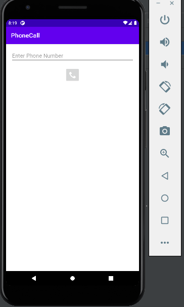
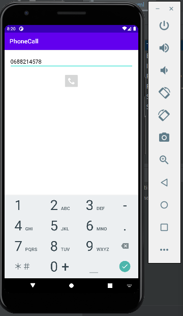
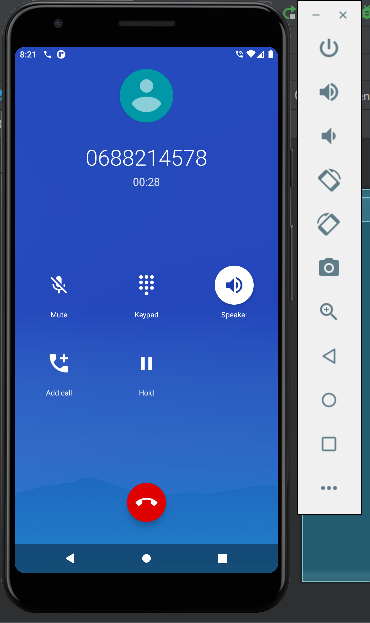

# MOBILE-APP-PHONE-CALL

<h3><u><b>a phone calls application  </u></b></h3>

<h5>First interface :</h5>
first interface where you can enter a number.
 

  

<h5>Second interface :</h5>
enter the number you will call it.
 

  

<h5>Third interface :</h5>
after clicking the button the call will start.
 

 

